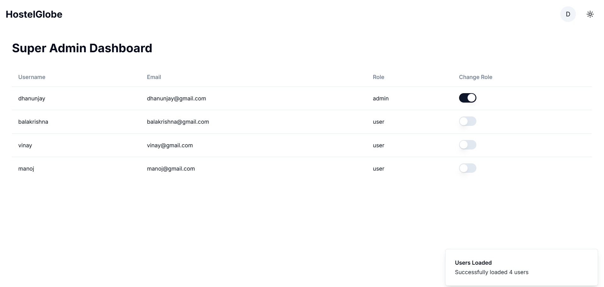

# HostelGlobe - Hostel Booking Platform

Live Demo: [HostelGlobe on Vercel](https://dhanu-globehostel-booking-platform.vercel.app/)

## Overview

HostelGlobe is a modern hostel booking platform built with Next.js and MongoDB. The platform features user authentication, role-based access control (including super admin), hostel exploration, and an admin dashboard. It offers a responsive design with dark mode support and integrates with Cloudinary for image management.

## Tech Stack

- **Frontend**: Next.js 13 (App Router), React 18, TypeScript (87.4%), JavaScript (11.5%)
- **Styling**: Tailwind CSS (1.1%)
- **Authentication**: NextAuth.js
- **Database**: MongoDB
- **Image Storage**: Cloudinary
- **Animations**: Framer Motion
- **Deployment**: Vercel

# HostelGlobe Application

HostelGlobe is a modern hostel booking platform built using Next.js. Users can browse hostels worldwide, admins can manage hostel listings, and super admins can oversee users and roles. The app features a stunning UI, dark/light mode toggles, and a responsive design.

---

## Features

### User Features:
- **Browse Hostels**: View hostels with images, descriptions, and pricing for available room types.
- **Hostel Details**: Click on a hostel to view detailed information, including phone number and pricing.
- **Sign Up/Login**:
  - Sign up with username, full name, email, mobile number, and password.
  - Login using username/email and password.
- **Responsive Design**: Supports light and dark modes for better accessibility.

### Admin Features:
- **Add Hostel**:
  - Name, images (uploaded to Cloudinary), seat availability, capacity (single, double, triple beds with prices), phone number, city, state, country, ZIP code, and description.
- **Manage Hostels**:
  - View, edit, and delete hostels.
- **Authentication**:
  - Admins have a dedicated dashboard for managing hostels.

### Super Admin Features:
- **User Management**:
  - Search and filter users by roles (users or admins).
  - Edit user roles or delete users (removes associated data).
- **Role-Based Dashboards**:
  - Redirect admins and super admins to their respective dashboards.

---

## Tech Stack

### Frontend:
- **Next.js** with **JavaScript**
- **Tailwind CSS**
- **MongoDB** (Database)
- **Cloudinary** (Image Uploads)

---

## Environment Variables

Set up the following values in a `.env` file:

```env
DB_URL="your mongodb url"
JWT_SECRET="dhanunjay"
CloudName="cloundname"
Api_Key="apikey"
Api_Secret="api_secret"
```

---

## Steps to Run the Application

### Prerequisites:
- Node.js
- MongoDB
- Cloudinary Account

### Steps:

1. **Clone the Repository**:
   ```bash
   git clone https://github.com/DHANUNJAY965/HostelGlobe-Hostel-Booking-Platform
   cd HostelGlobe-Hostel-Booking-Platform
   ```

2. **Install Dependencies**:
   ```bash
   npm install
   ```

3. **Set Environment Variables**:
   Create a `.env.local` file in the root and add the variables listed above.

4. **Run the Application**:
   ```bash
   npm run dev
   ```

5. **Access the Application**:
   Open your browser and navigate to `http://localhost:3000`.

---

## Usage

### For Users:
- Browse hostels and view details.
- Toggle between light and dark modes.

### For Admins:
- Add, update, and delete hostels.
- Manage all hostels via the admin dashboard.

### For Super Admins:
- Search, filter, and manage users.
- Change user roles and delete users.

---


## Screenshots

### Landing Page


### All Hostels


### Hostel Specific


### Admin Dashboard


### Super Admin Dashboard



---

## Future Features
- Hostel booking system.
- Payment gateway integration.
- Enhanced search and filter options for users.

---

## Contributing
Feel free to open issues or create pull requests for improvements. Contributions are welcome!

---

## License
This project is licensed under the MIT License. See the LICENSE file for details.

---

## Contact
For any inquiries or feedback, please contact:
- **Developer**: [Dhanunjay]
- **Email**: [dhanunjayaburada6@gmail.com]
- **GitHub**: [https://github.com/DHANUNJAY965]
